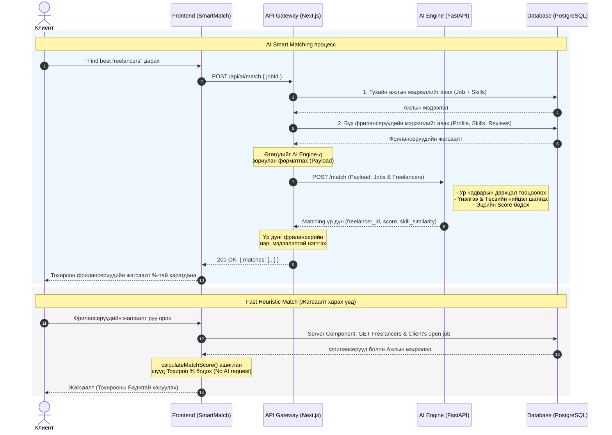

# AI Matching Sequence Diagram

Энэхүү Sequence Diagram нь таны код дахь `src/app/api/ai/match/route.ts` API болон `SmartMatch.tsx` дээр үндэслэн яг одоогийн бодит системийн ажиллагааг (Architecture) харуулж байна. Эх зурагтай ижил бүтцээр таны кодонд тохируулан зурлаа.

### Ялгаатай буюу Таны кодонд зориулсан хувилбарын онцлог:
1. **Өгөгдөл татах урсгал (Data fetching)**: AI Engine шууд Database-тэй харьцдаггүй бөгөөд Next.js API нь Database-ээс өгөгдлийг бэлтгэн AI Engine руу Payload байдлаар (JSON) дамжуулдаг байна.
2. **Real-time response**: AI Engine нь үр дүнг Database рүү хадгалалгүйгээр API руу шууд буцааж, Client талд response байдлаар очдог.
3. **Хоёр төрлийн matching**: 
   - Гүнзгий (Deep Match): AI Engine руу явуулах процесс.
   - Хурдан (Fast Heuristic): `clientJob` болон `calculateMatchScore` ашиглан жагсаалт дээр шууд харуулах хэсгийг нэмж орууллаа.
